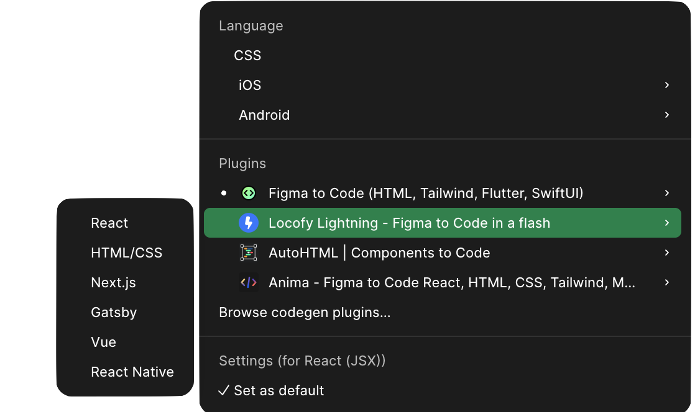

# GranadaTour-Card

Seminario **Componentes en React**

* Diseño de una Card usando modelo atomic design 

* Card inspirada en https://walkingranada.com/

Componentes: 

* TourCardBasic
* TourCard
* TourCardProps


## 2. Instalación

* **Instalar Node.js** React necesita  `node` y `npm`

  Verifica la instalación:

  ```sh
  node -v
  npm -v
  ```

* **Proyecto con Vite**

  ```sh
  npm create vite@latest mi-app
  ```

  Selecciona:

  - Framework → React
    - Variant → JavaScript  (extension **.jsx**)
    - Typescript  (extension **.tsx**)

* **Instalar dependencias**

  ```sh
  npm install
  ```

* **Iniciar servidor**

  ```sh
  npm run dev
  ```

* URL servidor por defecto:

  ```http
  http://localhost:5173/
  ```


## 3. UI Cards: Modelo diseño atómico (React)

Ejemplo: 

Vamos a diseñar las UI Cards de la siguiente página: https://walkingranada.com/

 


#### Átomos

##### `CardImage.jsx`

```jsx
function CardImage({ src, alt }) {
  return (
    
  );
}

export default CardImage;
```

##### `CardTitle.jsx`

```jsx
function CardTitle({ title }) {
  return (
    <h2 className="card-title">
      {title}
    </h2>
  );
}

export default CardTitle;
```

##### ``CardDescription.jsx``

```jsx
function CardDescription({ text }) {
  return (
    <p className="card-description">
      {text}
    </p>
  );
}

export default CardDescription;
```

##### ``PrimaryButton.jsx``

```jsx
function PrimaryButton({ label }) {
  return (
    <button className="primary-button">
      {label}
    </button>
  );
}

export default PrimaryButton;
```

#### Moleculas

##### ``CardContent.jsx``

```jsx
import CardTitle from "../atoms/CardTitle";
import CardDescription from "../atoms/CardDescription";

function CardContent({ title, description }) {
  return (
    <div className="card-content">
      <CardTitle title={title} />
      <hr />
      <CardDescription text={description} />
    </div>
  );
}

export default CardContent;
```

##### ``CardActions.jsx``

```jsx
import PrimaryButton from "../atoms/PrimaryButton";

function CardActions() {
  return (
    <div className="card-actions">
      <PrimaryButton label="Saber más >" />
    </div>
  );
}
export default CardActions;
```


#### Organismos

##### ``TourCard.jsx``

```jsx
import CardImage from "../atoms/CardImage";
import CardContent from "../molecules/CardContent";
import CardActions from "../molecules/CardActions";

function TourCardBasic() {
  return (
    <div className="tour-card">

      <CardImage
        src="/images/alhambra.jpg"
        alt="Alhambra"
      />

      <CardContent
        title="Alhambra"
        description="Descubre la Alhambra, sus jardines y palacios.
        Visita guiada privada o en grupo."
      />
      <CardActions />

    </div>
  );
}

export default TourCardBasic;
```

#### Page

##### ``App.jsx``

```jsx
import TourCardBasic from "./components/organismos/TourCardBasic";
import TourCard from "./components/organismos/TourCard";


import './App.css'

function App() {
  return (
    <div className="container">
      <TourCardBasic />
    </div>
  );
}

export default App
```


Estructura del proyecto

```
src/
├── components/
│   ├── atoms/
│   │     ├── CardImage.jsx
│   │     ├── CardTitle.jsx
│   │     ├── CardDescription.jsx
│   │     └── PrimaryButton.jsx
│   ├── molecules/
│   │     ├── CardContent.jsx
│   │     └── CardActions.jsx
│   │
│   └── organisms/
│         └── TourCard.jsx
│
├── App.jsx
└── styles.css

```


## 4. Figma to Code  

Otra opción que tenemos es pasar de DISEÑO a CODE con <Dev Mode> En este caso, partimos de un  **layout responsive** y **estilos** definidos correctamente. Los elementos que podemos exportar son: 

* **Color Styles**
  * Primary / Blue, Secondary / Purple
* **Text Styles**
  - Heading

  - Body

  - Caption


* **Espacios** y dimensiones
  * 4, 8, 12, 16, 24, 32, 48
* **Componentes en Figma con Variantes** 
  - Button con Variants


  ```
Button
 ├── Primary
 ├── Secondary
 ├── Danger
 └── Disabled
  ```

Eso luego se traduce perfecto a React:

```
<Button variant="primary" />
```

Todos esos elementos de diseño se pueden convertir en **Design Tokens**, que son **variables de estilo** que normalmente se crean con el Design System Foundation. 


### Figma Inspect 

Al seleccionar un elemento de diseño para <DEV mode>  , podemos usar las siguientes plugins/inspectores de código



Los inspectores que podemos usar en <Dev Mode> son: 

* Figma to Code -> HTML (React)
* **Locofy**  (https://www.locofy.ai/)
  * Plugin de inspeccion en Figma 
  * Tambien tiene versión web online de paso de Figma a CODE (Tokens$) 
* Anima (https://www.animaapp.com/figma)


En el caso de **Locofy to React no respeta el diseño atómico** 

```jsx
/* TourCard */
import { FunctionComponent } from 'react';
import styles from './TourCard.module.css';


const TourCard: FunctionComponent = () => {
  	return (
    		<div className={styles.tourcard}>
      			
      			<div className={styles.cardcontent}>
        				<div className={styles.titulo}>
          					<b className={styles.heading3}>Experiencias</b>
        				</div>
        				<div className={styles.separator} />
        				<div className={styles.carddescription}>
          					<div className={styles.description}>Rutas diferentes, excursiones y<br/>experiencias únicas para<br/>descubrir Granada.</div>
        				</div>
        				<div className={styles.separator} />
      			</div>
      			<div className={styles.cardaction}>
        				<div className={styles.button}>
          					<div className={styles.buttonLabel}>{`Saber más >`}</div>
        				</div>
      			</div>
    		</div>);
};

export default TourCard ;

```

El estilo lo adapta correctamente, pero con demasiados datos...

```css
.tourcard {
  	width: 100%;
  	height: 506px;
  	position: relative;
  	box-shadow: 0px 0px 20px rgba(0, 0, 0, 0.15);
  	border-radius: 30px;
  	background-color: rgba(255, 255, 255, 0);
  	display: flex;
  	flex-direction: column;
  	align-items: center;
  	gap: 21px;
  	text-align: left;
  	font-size: 24px;
  	color: #ea2323;
  	font-family: Outfit;
}
.cardimageIcon {
  	align-self: stretch;
  	height: 190.3px;
  	border-radius: 30px 30px 0px 0px;
  	max-width: 100%;
  	overflow: hidden;
  	flex-shrink: 0;
  	object-fit: cover;
}
.cardcontent {
  	width: 265px;
  	display: flex;
  	flex-direction: column;
  	align-items: flex-start;
  	gap: 22px;
}
.titulo {
  	align-self: stretch;
  	display: flex;
  	align-items: center;
  	justify-content: center;
}
.heading3 {
  	height: 32px;
  	flex: 1;
  	position: relative;
  	line-height: 32px;
  	display: flex;
  	align-items: center;
}
.separator {
  	align-self: stretch;
  	height: 1px;
  	position: relative;
  	background-color: rgba(0, 0, 0, 0.1);
  	overflow: hidden;
  	flex-shrink: 0;
}
.carddescription {
  	align-self: stretch;
  	display: flex;
  	align-items: center;
  	justify-content: center;
  	font-size: 18px;
  	color: #000;
}
.description {
  	height: 87px;
  	flex: 1;
  	position: relative;
  	line-height: 32px;
  	font-weight: 300;
  	display: flex;
  	align-items: center;
}
.cardaction {
  	border-radius: 70px;
  	background-color: #ea2323;
  	display: flex;
  	align-items: center;
  	justify-content: center;
  	padding: 20px 30px;
  	font-size: 20px;
  	color: #fff;
}
.button {
  	display: flex;
  	align-items: center;
  	justify-content: center;
}
.buttonLabel {
  	position: relative;
  	line-height: 25px;
}

```

### Parametrización 

Se puede optimizar el componente mediante uso de **Props** 


``` jsx
/*** TourCardProps - Crear una card parametrizado con prop. basada en TourCard */
import styles from './TourCard.module.css';

function TourCardProps({
  title,
  description,
  image,
  buttonText = "Saber más >",
}) {
  return (
    <div className={styles.tourcard}>
      
      

      <div className={styles.cardcontent}>
        <div className={styles.titulo}>
          <b className={styles.heading3}>{title}</b>
        </div>
        <div className={styles.separator} />

        <div className={styles.carddescription}>
          <div className={styles.description}>
            {description}
          </div>
        </div>
        <div className={styles.separator} />

      </div>

      <div className={styles.cardaction}>
        <div className={styles.button}>
          <div className={styles.buttonLabel}>
            {buttonText}
          </div>
        </div>
      </div>

    </div>
  );
}

export default TourCardProps;
```

Se utilizarían los componetes con props:

``` jsx
       <TourCardProps 
        title="Visitas Guiadas"
        description="Visitas guiadas a medida para ti y tu grupo. Descubre los secretos de Granada."
        image="https://walkingranada.com/wp-content/uploads/2023/01/visitas-guiadas-card.webp"
        buttonText="Saber más >"
      />

```


### Bibligrafía. 

- Introduction to React ``{() => fs}``  (full stack fi Mooc course) https://fullstackopen.com/es/ 
  - https://fullstackopen.com/es/part1
- React Learn https://react.dev/learn/ 
  - Your first component -> https://react.dev/learn/your-first-component
- (midulive 2023) Midudev: React desde cero -> https://www.youtube.com/watch?v=7iobxzd_2wY
- DISEÑO -> **UI CARDS** 

  * UX Design World - Best Practices for Designing UI Cards https://uxdworld.com/designing-ui-cards/

  * UI FROM MARS - Guía para diseñar cards en UI: Mejores prácticas y ejemplos https://uifrommars.com/guia-diseno-cards/

  * UXABLES | Blog - Qué es y cómo diseñar una Card https://www.uxables.com/diseno-ux-ui/que-es-y-como-disenar-una-card/

* **Bibliotecas UI**  

  -  Untitled UI React! This library is a collection of UI components based on the world's largest and most popular Figma UI kit and design system. https://www.untitledui.com/react/docs/introduction

  -  Shadcn UI is a collection of beautifully designed, accessible React components built with Radix UI https://www.shadcn.io/ui

  -  Radix UI https://www.radix-ui.com/themes/playground


----

*Diseño de Interfaces de Usuario, Universidad de Granada*

Repo: 

*CC BY M. Gea,  abril 2026*


